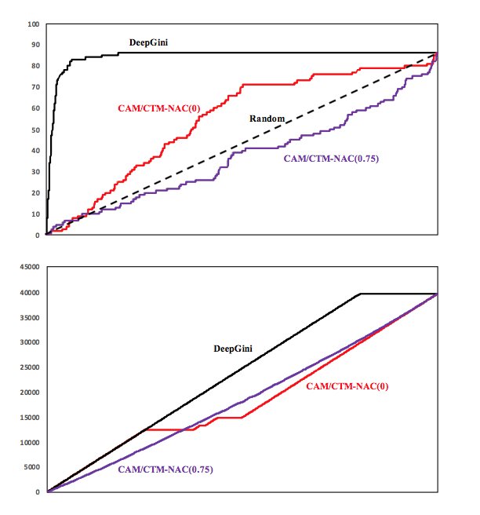
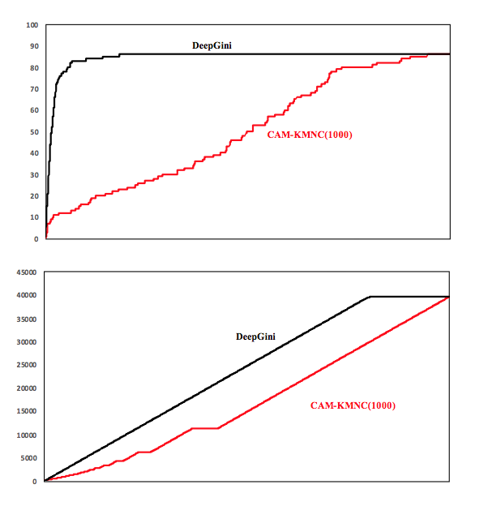

# DeepGINI

DeepGINI is a test data sorting technology for deep learning. This warehouse is the experimental code of DeepGINI.

-------

## How to run the code
Since the original data is relatively large, we uploaded some of the data to the Baidu network disk. The data connection is as follows:

```
link:https://pan.baidu.com/s/15YBR3uFblcQ1HNXdUuKfPw  
password:gqrb
```

After copying this repository to your local location, overwrite some of the folders with the data you downloaded above.

This experiment is implemented using python3.x and the environment depends on the following:

```
scikit-learn>=0.19.0
keras>=2.1.5
pandas>=0.23.4
numpy>=1.14.2
tensorflow>=1.6.0
tqdm>=4.23.0
foolbox>=1.7.0
```

-------

## File code structure

`model_mnist.py`,`model_fashion.py`,`model_svhn.py` and `model_cifar10.py` are model training and are trained for these training sets.

`generate_adv.py` is a file that generates a corresponding adversarial sample.

`metrics.py` is a file that sorts the samples using different overlay methods.

`statistic.py`  is used to calculate apfd.

Files such as `*_exp.py` are specific experiments for different data sets.

-------

## Data file structure

This data contains 5 folders,`data`,`fashion-mnist`,`model`,`adv_image`,`all_output`.
The data we use are mnist dataset, svhn dataset, fashion dataset, cifar10 dataset.

`data`:This folder mainly contains training data and test data of the svhn data set.

`fashion-mnist`:This folder mainly contains the training data and test data of the fashion data set and the calling code.

`model`:This folder mainly contains the four models we trained in the experiment. The model uses tensorflow as the calculation graph engine and is trained by keras.

`adv_image`:We use fgsm, jsma, cw, and bim to generate a adversarial sample for the corresponding dataset. The data structure is ndarray in numpy, which is stored as .npy file using python's pickle method.

`all_output`:The experimental results of deepgini are stored in this folder. We store the experimental results in CSV format. The file name of each csv corresponds to the method and parameters of the overlay. Each csv file contains four columns: the 'right' column indicates whether the model prediction for the sample is correct, the 'cam' column indicates the cam order for the sample (0 means no sort), and the 'ctm' column indicates ctm sorting, the 'rate' column indicates the coverage of the collection.

-------

## Experimental result




